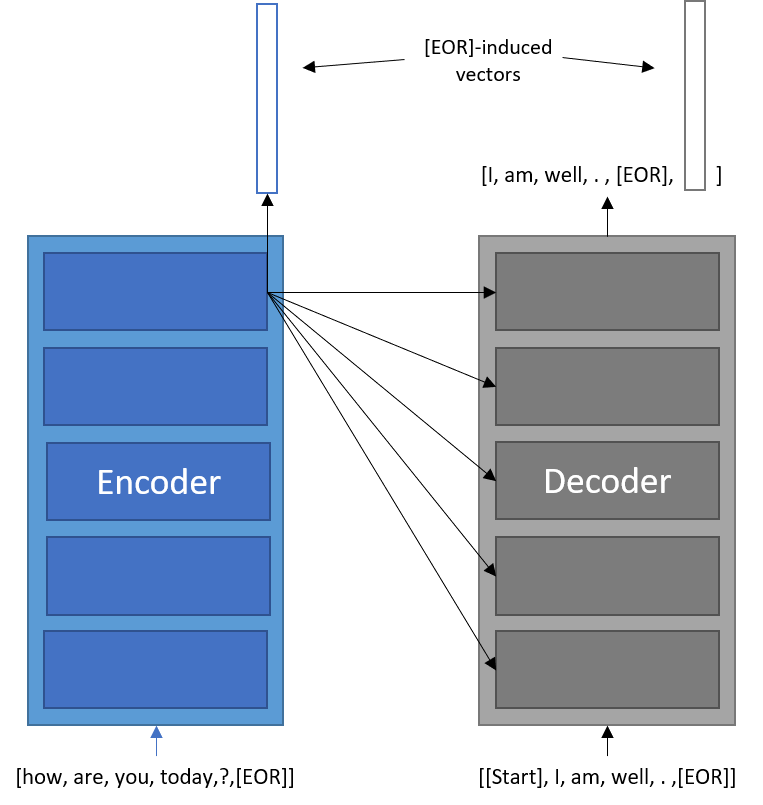
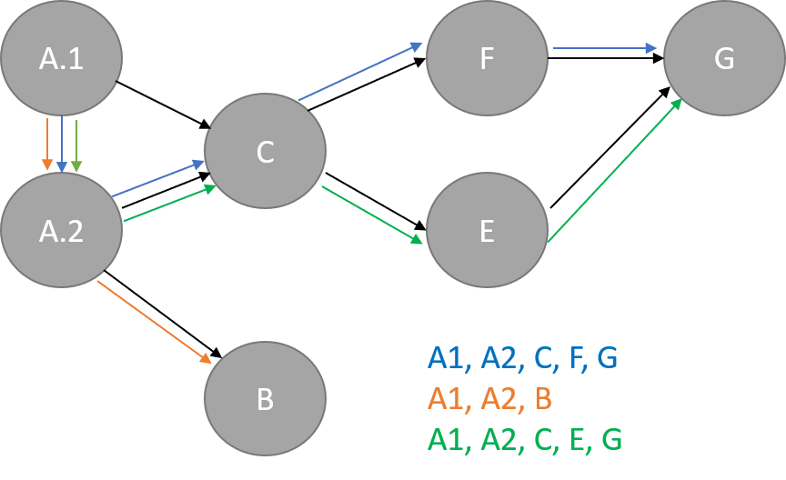

# ChatterBot: Jointly Generative and Selective Transformer Chatbot

## Description

Fundamentally, a generative chatbot can be constructed using the same techniques and architectures as a neural machine translation problem. The conversation is *encoded* into a context, then that context is *decoded* into a new reply which is constructed auto-regressively using a conditioned language model. Previously, the go-to architecture for modeling these seq2seq-style problems was the RNN, then RNN+attention, and now the fully-attentive Transformer. Generative chatbots can produce novel response to novel context if trained on enough data, but are prone to generic responses. Additionally, the language they use is a reflection of their corpus, which can be problematic if trained on a corpus like Reddit text, and they are not well-suited for task-oriented conversations.

The other overarching category of chatbot is the Selective chatbot. This style of chatbot uses similarity scores between an embedded context and a database of candidate responses to choose the most appropriate response. This allows the designer to hand-craft dialogue and control how the bot interacts with users. Unfortunately, this means the conversation will never be original.

Scoring candidate responses is itself an sequence-related problem, and could be concievably framed with a Transformer model acting as the embedding architecture from which to calculate similarity scores. Because the generative and selective chatbot formulations suggest the use of similar models and share a similar foundation in language understanding, I believe the tasks can be learned jointly to create a model that performs better on either task than trained seperately. 

For example, the generative chatbot is essentially a language model, the underpinning of many recent successes in NLP transfer learning. This suggests a better selective chatbot may be built around or with a language model. Conversely, a strictly generative chatbot may be able to ad-lib, but will fail in task-oriented situtations. A hybid model which can choose from novel text and pre-made responses may improve user experience in this situation.

## Architecture

BERT, or Bidirectional Encoder Representations from Transformers, demonstrated the ability of Transformers to output embeddings for upstream classification layers when induced by a special token in the input sequence, for instance ```[CLS]``` for class. I believe this functionality can be incorporated into a generative seq2seq Transformer to induce the output vector for similarity comparisons. This would allow the transformer to jointly learn generative and selective modeling, essentially training it to rate its own responses.

There are then two training objectvies. First, the selective modeling functionality will be trained using triplet loss, in which the model learns to embed contexts and responses in a joint n-dimensional space in which more appropriate context-response pairs are closer in that space. Second the generative functionality will try to maximize the probability of recreating the ground-truth response given a particular context. These losses may be minimized using the following formula:

L(context, response_true, response_false) = max(0, sim(E(context), D(response_true)) - sim(E(context), D(response_false)) + a) + log P(response_true | context)

where E is the encoder function, D is the decoder function, and a is the triplet loss scalar. The first equation shows the triplet loss on anchor, positive, and negative samples (context, response_true, response_false), while the second equation shows the maximization of the log-likelihood of generating the true response. The architecture is shown below:
<br><br>
<br>
Figure 1. Transformer architecture.
<br>

Additionally, I plan to use relative positional embeddings in the attention layer, which will be dependent on the features of distance between two word representations and whether that word is part of a response by a user or the entity the chatbot is learning to mimic. I belive this style of positional embedding will lend more ceherence to the string of responses from multiple entities in the context.

## Data

### Conversation Modeling

The database I am using includes 3 million tweets from conversations between users and customer service accounts for major brands including Spotify, Apple, and Verizon. In long form, this database gives each tweet as a response to one or more other tweets. Furthermore, a tweet may be a response to multiple tweets from different users, or multiple tweets in series from the same user. All this makes Twitter conversations unexpectantly convoluted, and so I took to thinking of conversations as DAGs. Below is an example of interdependencies between tweets represented as a DAG, each edge being a response connection. Nodes A.1 and A.2 are tweets by the same user that were both responsed to by tweet C. My algorithm for generating topological orderings uses breadth-first search from root nodes and flattens layers of the graph to include single-user tweet series. Given the DAG in Figure 2, my algorithm finds the listed conversations chains.
<br><br>
<br>
Figure 2. Conversation DAG and topological orderings discovered.
<br>

My BFS algorithm was implemented in Spark SQL to efficiently construct nearly 1 million conversations from the 3 million tweets. The process took less than 5 minutes, so this could easily be expanded to more tweets if I found another database. The sequences this yielded were then broken into 5-tweet sub-sequences for training. At inference time, an entire conversation may be used for context because my relative positional encoding scheme is expandable to any context length, but this is not practical for training when number of examples is more important than learning very long-range dependencies. 

### Subword Embeddings

The go-to method for representing language in a fixed-length vocab for neural networks is subword embedding, where common words can be represented directly, while rare words can be constructed out of smaller multi-character blocks. This allows the network to learn higher level meanings for many words while also eliminating the out-of-vocab problem when encountering new words. My pre-processing technique for the tweets will follow these steps:

1. Use regex to filter out numbers, urls, and emojis, replacing some with tokens, 
2. Use byte-pair encoding for tokenization into subwords. I also plan to incorporate a special Capitalize <\c> token, and switch speaker <\s> token. The speaker token may help the Transformer learn better representations for the context, while the capitalize token will help it produce formatted text that can be displayed directly to a user.
3. Encode byte-pairs as index from vocabulary.
4. Append and pad sequences for feeding into network.

### Progress

* Finished programming architecture
* Finished mining for conversations, represented as lists of tweet IDs
* To Do:
  * Byte-pair encoding of input sequences
  * Finish data input pipeline
  * Train network. Probably going to rent cloud time because it takes a while to train a language model.

