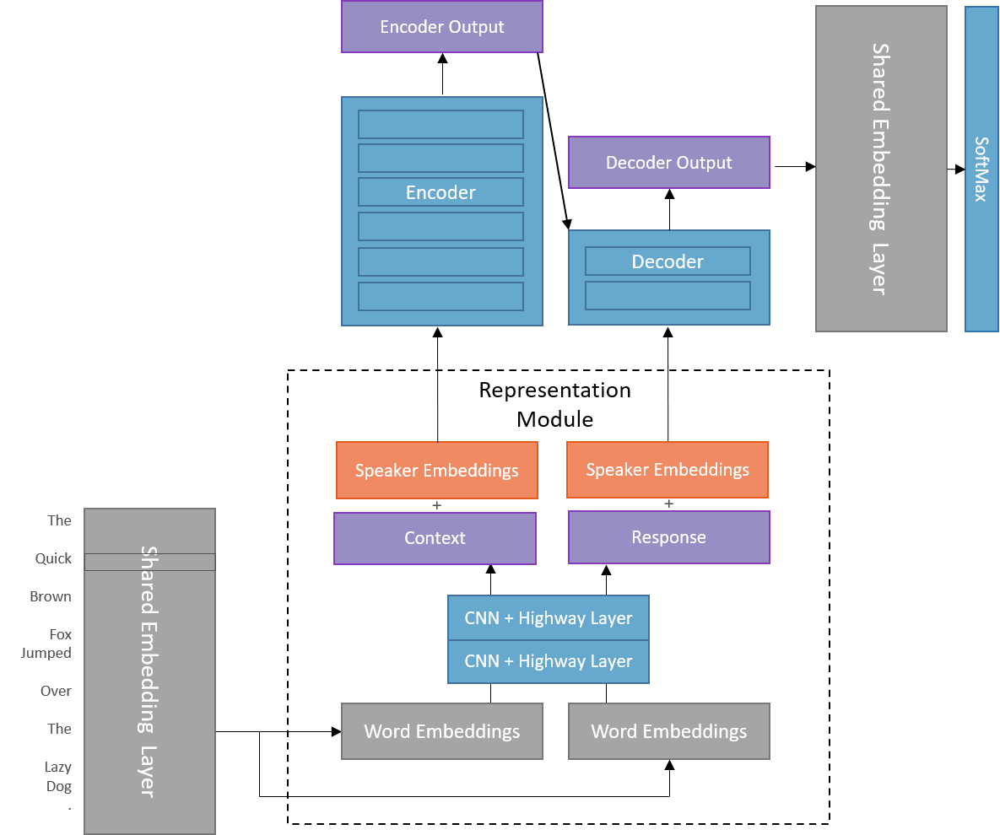
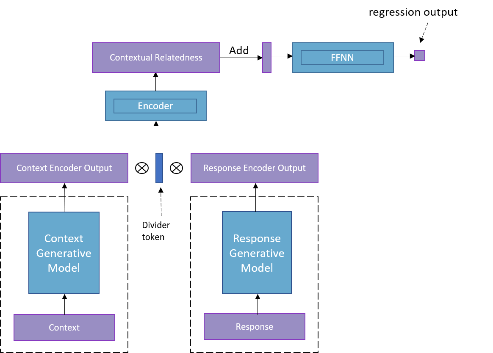
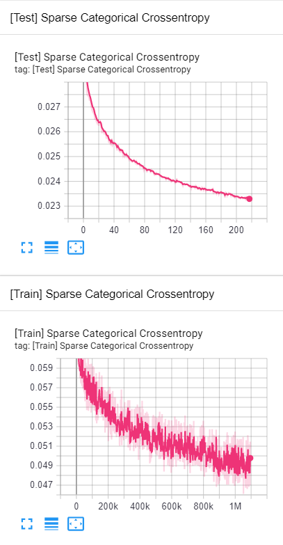

# ChatterBot: Pretrained Generative Transformers for Selective Chatbot

## Description

Recent advancements in seq2seq models, specifically the Transformer, have shown promise in creating an end-to-end chatbot solution. Google recently showed with Meena that an interesting conversant can be trained with a purely generative model, but its application in goal-oriented environments or specific domains remains illusive because of the massive amount of training data required. Also, with generative models, the owner cannot supply pre-existing responses, which opens them up to risk the chatbot might say something offensive or off topic. 

Because of this, selective chatbots, which choose from an array of responses are more widely applicable. The goal of this project is to design an selective chatbot architecture that uses Transformers for more contextual-aware responses.

## Architecture

My approach to incorporating context-aware Transformers into a selective chatbot relies on research that shows unsupervised pre-training of models on a general language modeling objective allows those models to be retrained for other tasks with high performance. Thus, to develop a model that can embed context and reponses with impotant contextutal information, I will pretrain two seq2seq Transformer models on a conversation corpus. One Transformer will encode the context and predict the response (the traditional se2seq method), and the other will encode the response and predict the context. This approach mimics the skip-gram approach to producing sentence embeddings, but uses Transformer encoders rather than RNNs. The specific architecture is shown below. I have incorporated a shared highway CNN layer to learn n-grams from subword tokens and speaker embeddings added to pretrained word-embeddings for representation.
 

 
Figure 1A. Generative model. Shown encoding context to predict response. 

In each generative model, the encoder stack is far more powerful than the decoder stack. This is because the encoder is the ultimate product of this training, and it forces the model to invest more in the richness of encoder embeddings to reduce training loss. 

With the two generative models trained, the encoders from each can be used to produce features for the selective model. The selective model takes as input the encoded context representation concatenated to the encoded response representaion. The typical cosine-similarity vector comparison in compatibility scoring is replaced by a Transformer encoder layer, followed by rolling up of the output matrix. Lastly, a Feed-forward layer reduces the embedding to a scalar compatibility score. The selective model is trained with the Triplet loss formula to ensure more compatible responses recieve higher scores. 

Figure 1B. Selective model.

I predict this architecture will produce a highly generalizable and robust selective chatbot that can quickly select from an array of responses, while incorporating rich contextual information in its selection.

## Data

### Conversation Modeling

The database I am using includes 3 million tweets from conversations between users and customer service accounts for major brands including Spotify, Apple, and Playsation. In long form, this database gives each tweet as a response to one or more other tweets. Furthermore, a tweet may be a response to multiple tweets from different users, or multiple tweets in series from the same user. All this makes Twitter conversations unexpectantly convoluted, and so I took to thinking of conversations as DAGs. Below is an example of interdependencies between tweets represented as a DAG, each edge being a response connection. Nodes A.1 and A.2 are tweets by the same user that were both responded to by tweet C. My algorithm for generating topological orderings uses breadth-first with one-step lookahead from root nodes and flattens layers of the graph to include single-user tweet series. Given the DAG in Figure 2, my algorithm finds the listed conversations chains, while merging multi-message-one-user events into agglomerated messages.

  
 
Figure 2. Conversation DAG and topological orderings discovered.
 

The algorithm was implemented in Spark SQL to efficiently construct nearly 1.7 million context-response pairs from the 3 million tweets. The process took less than 5 minutes, so this could easily be expanded to more tweets if I found another twitter support dataset. A breakdown of conversations mined shows that conversations with one response make up the majority of conversations. That pattern is explained by support agents frequently requesting the user send them a direct message, then their conversation leaving the record. Plotted with log scale to show all frequencies, an interesting pattern emerges: the frequencies are often grouped in pairs of two. What this shows is that the user requesting support is most likely to end the conversation, since users respond at length = 0, 2, 4, 6, etc. This is likely because they get the help they need, then thank the support agent to end the conversation.

 
Figure 3. Length of conversations in the dataset.

Constructing these conversation trees hit the upper limit of my processing power, but I would like to add more conversations to my training data. Fortunately, another customer support corpus, the Ubuntu dialogue corpus, has a similar structure so I can easily adapt my script to mine its *(context, response)* pairs as well. Unfortunately, It contains over 8 times as much data, so I will need to rent some processing power before I can add that source to my data. 

### Subword Embeddings

The go-to method for representing language in a fixed-length vocab for neural networks is subword embedding, where common words can be represented directly, while rare words can be constructed out of smaller multi-character blocks. This allows the network to learn higher level meanings for many words while also eliminating the out-of-vocab problem when encountering new words. My pre-processing technique for the tweets will follow these steps:

1. Use regex to filter out urls, phone numbers, signatures, usernames, and emojis, replacing some with tokens,
2. Use Sentencepiece encoding for tokenization into subwords. The vocab size, 8000, was taken from Google's Meena which found this to be sufficient for generating quality responses while reducing the model parameters.
3. Encode subwords as index from vocabulary.
4. Append and pad sequences for feeding into network.

### Embedding Layer

I used word2vec to obtain pre-trained word embeddings, which will be frozen during training to reduce model complexity. The same embeddings will be used for the encoder, decoder, and softmax layers of the Transformer to further reduce parameter size.

### Training

To reduce the space needed to train this model, I trained with mixed precision. Weights, loss, and gradients were calculated in fp32, while forward propagation was calculated in fp16. I utilized dynamic loss scaling to prevent gradient underflow. Training metrics were recorded to a Tensorboard dashboard every 50 steps, and the model was evaluated on the test set using the same metrics at the end of every epoch. Additionally, samples of the model's response to test-set contexts were sampled and displayed every epoch. 

# Results

Training is ongoing at this moment! I estimate that each generative model will need to train for 15 days to make interesting responses, so I am spinning up for training when I don't need my computer for anything else. So far we're at 5 full days of training and chatbot responses are not interesting/thoughtful as of yet. Train and test losses plunge promisingly downward. The problem of short/safe responses is already revealing itself, as the stop token that truncates the response is selected with high probability after one or two words in the response. Ultimately, this generative chatbot may never produce interesting responses, but will provide rich contextual embeddings for the selective portion of the model.

Chatbot Samples: 
Tweet: So sad how BAD @116988 customer service went from best to worst. India agents have no clue and screw up everything.  
Response: <@usr> Why
  
Tweet: @115850 now confused,same product showing two prices same time. Have already paid 2099 in one of the order thinking I am paying ~978 https://t.co/SyCN5cKH23  
Response: <@usr> Lol

#### Catastrophe! A windows update killed my training routine and restarting the model does not lead to further reduction in training loss. This is likely because the ADAM optimizer's weight-specific gradient variables were not saved, so the optimizer lost momentum and is stuck in some minima. I'll have to retrain from scratch.

Given this setback, I am going to wait to train until I have more compute resources at my disposal for training. I will likely rent time on a cloud VM.