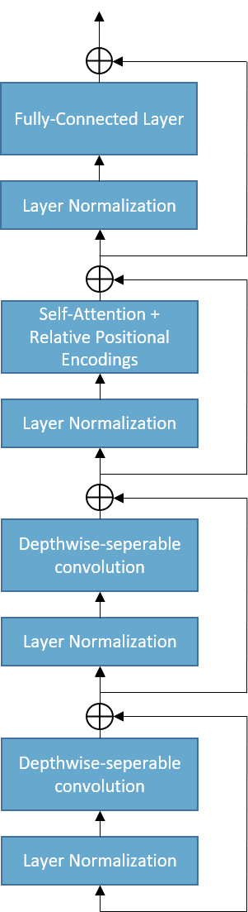

# ChatterBot: Transformers for Selective Chatbot

## Description

Recent advancements in seq2seq models, specifically the Transformer, have shown promise in creating an end-to-end chatbot solution. Google recently showed with Meena that an interesting conversant can be trained with a purely generative model, but its application in goal-oriented environments or specific domains remains illusive because of the massive amount of training data required. Also, with generative models, the owner cannot supply pre-existing responses, which opens them up to risk the chatbot might say something offensive or off topic. 

Because of this, selective chatbots, which choose from an array of responses are more widely applicable. The goal of this project is to design an selective chatbot architecture that uses Transformers for more contextual-aware responses.

## Architecture

 
Figure 1. Transformer selective chatbot architecture

 
Figure 2. Encoder layer arcitecture 

 

My approach to using the Transformer architecture is outlined in Figure 1. First, I employ word2vec embeddings for representation of the context and response sequences, which are then run through a shared highway CNN layer that serves to blend word embeddings with n-gram context. On top of these representations, speaker embeddings are concatenated that encode the who authored each word in the sequences. 

Next, the context and response are passed through a powerful Transformer encoder blocks that extract important semantic information from each sequence. The architecture for each encoder block is shown in Figure 2, and incorportates depthwise-seperable convolutions and relative positional encodings, both shown to increase the effectiveness of the basic Transformer block pioneered in Vaswani, et al. 

With the context and response processed by the encoder blocks, their representations are mixed in single Tranformer decoder block, which calculates context-response multi-headed attention. The rational behind this small decoder is that the response database is stored as encoded sequences. An incoming context sequence is also encoded. To select a response from the database, the "Regression Module" must compare encodings of every response for the given context, and it must do this quickly. 

Following the decoder block, the representation is averaged over time, and the flattened output linearly transformed to give a "compatibility score". Triplet loss training ensures compatible context-response pairs have higher scores.

## Data

#### Conversation Modeling

The database I am using includes 3 million tweets from conversations between users and customer service accounts for major brands including Spotify, Apple, and Playsation. In long form, this database gives each tweet as a response to one or more other tweets. Furthermore, a tweet may be a response to multiple tweets from different users, or multiple tweets in series from the same user. All this makes Twitter conversations unexpectantly convoluted, and so I took to thinking of conversations as DAGs. Below is an example of interdependencies between tweets represented as a DAG, each edge being a response connection. Nodes A.1 and A.2 are tweets by the same user that were both responded to by tweet C. My algorithm for generating topological orderings uses breadth-first with one-step lookahead from root nodes and flattens layers of the graph to include single-user tweet series. Given the DAG in Figure 2, my algorithm finds the listed conversations chains, while merging multi-message-one-user events into agglomerated messages.

  
 
Figure 2. Conversation DAG and topological orderings discovered.
 

The algorithm was implemented in Spark SQL to efficiently construct nearly 1.7 million context-response pairs from the 3 million tweets. The process took less than 5 minutes, so this could easily be expanded to more tweets if I found another twitter support dataset. A breakdown of conversations mined shows that conversations with one response make up the majority of conversations. That pattern is explained by support agents frequently requesting the user send them a direct message, then their conversation leaving the record. Plotted with log scale to show all frequencies, an interesting pattern emerges: the frequencies are often grouped in pairs of two. What this shows is that the user requesting support is most likely to end the conversation, since users respond at length = 0, 2, 4, 6, etc. This is likely because they get the help they need, then thank the support agent to end the conversation.

 
Figure 3. Length of conversations in the dataset.

Constructing these conversation trees hit the upper limit of my processing power, but I would like to add more conversations to my training data. Fortunately, another customer support corpus, the Ubuntu dialogue corpus, has a similar structure so I can easily adapt my script to mine its *(context, response)* pairs as well. Unfortunately, It contains over 8 times as much data, so I will need to rent some processing power before I can add that source to my data. 

#### Normalization and Preprocessing

The text in my database is straight from Twitter, and is quite noisy with URLs, phone numbers, usernames, and emojis. All these are junk that may detriment training of my chatbot, so I wrote regex expressions that filter for these effects and replace some that are semantically relevant with a token. For instance, all usernames were replaced with "\<usr\>" and all URLS were replaced with "\<url\>". 

Next, I tokenized the text using Sentencepiece byte-pair encoding, which is a language agnostic technique that iteratively builds n-grams from frequent sequences. This encoding technique eliminates the Out-of-Vocab problem faced with traditional word level tokenization, as frequent words are represented as their whole string, while rare words are deconstructed into a series of subwords and chargrams. This encoding technique also captures suffixes and prefixes that form larger words and tokenizes based on these word-parts as well. 

I used a pre-trained byte-pair encoder from the BPEmb package, and I populated my embedding layer with their pre-trained distributed word vectors. Since I introduced my own custom tokens into my representation, I randomly initialized their embeddings to be trained later by backprop.

Lastly, I encoded the text and speaker ids into padded sequences and stored them for fast loading and transforming during training.

## Training

#### Mixed Precision

To reduce the space needed to train this model, I trained with mixed precision. Weights, loss, and gradients were calculated in fp32, while forward propagation was calculated in fp16. I utilized dynamic loss scaling to prevent gradient underflow. Training metrics were recorded to a Tensorboard dashboard every 50 steps, and the model was evaluated on the test set using the same metrics at the end of every epoch. 

#### Online Triplet Mining

Tiplet loss depends on an Anchor, Positive, and Negative example. In my case, the Anchor is always the context, while the positive example is the ground truth response and the negative example is any other response from the corpus. To train using this method, one must find "hard" triplets, such that the compatibility between the anchor and negative example is higher than between the anchor and positive example plus some margin. Rather than mine triplets at the start of an epoch, I used online triplet mining.

A given batch of 64 *(context, response)* pairs contains 64 positive examples and 4032 negative examples. After calculating the compatibility between every context-response pair in the batch, the semi-hard and hard triplets' scores are averaged according to the Batch All strategy. The difference in compatibility between positive examples and averaged hard negative examples forms the training loss.

## Results

Training is ongoing at this moment! 
