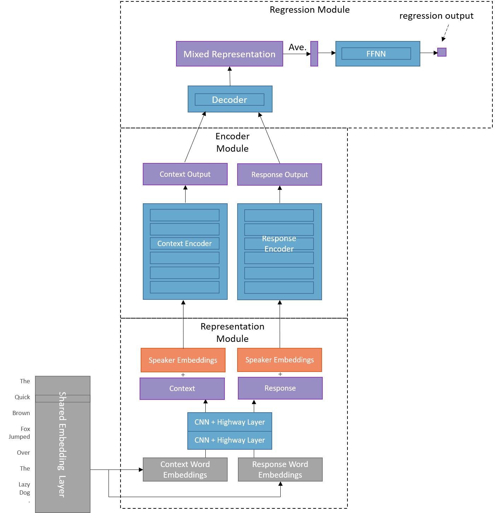

# ChatterBot: Jointly Generative and Selective Transformer Chatbot

## Description

Fundamentally, a generative chatbot can be constructed using the same techniques and architectures as a neural machine translation problem. The conversation is *encoded* into a context, then that context is *decoded* into a new reply which is constructed auto-regressively using a conditioned language model. Previously, the go-to architecture for modeling these seq2seq-style problems was the RNN, then RNN+attention, and now the fully-attentive Transformer. Generative chatbots can produce novel response to novel context if trained on enough data, but are prone to generic responses. Additionally, the language they use is a reflection of their corpus, which can be problematic if trained on a corpus like Reddit text, and they are not well-suited for task-oriented conversations.

The other category of chatbot is the Selective chatbot. This style of chatbot uses similarity scores between an embedded context and a database of candidate responses to choose the most appropriate response. This allows the designer to hand-craft dialogue and control how the bot interacts with users. Unfortunately, this means the conversation will never be original.

Scoring candidate responses is itself an sequence-related problem, and could be concievably framed with a Transformer model acting as the embedding architecture from which to calculate similarity scores. Because the generative and selective chatbot formulations suggest the use of similar models and share a similar foundation in language understanding, I believe the tasks can be learned jointly to create a model that performs better on either task than trained seperately. 

For example, the generative chatbot is essentially a language model, the underpinning of many recent successes in NLP transfer learning. This suggests a better selective chatbot may be built around or with a language model. Conversely, a strictly generative chatbot may be able to ad-lib, but will fail in task-oriented situtations. A hybid model which can choose from novel text and pre-made responses may improve user experience in this situation.

## Architecture

My architecture extends the successful QANet architecture, which relies on a shared representation module for the context and response (since they are the same language in QA and chatbot applications), followed by a decoder module to produce distributions over the embeddings for softmax logits. The shared embeddings, CNN+highway, which learns common n-grams from subword embeddings, and low-level transformer layers reduce parameters needed to perform similar functions in the context and response flows.

In addition to the generative module, my selective model also uses the shared representation module as input. The selective model is composed of transformer layers, and the output context/response embedding vectors are averages of the transformer output vectors, as in S-BERT, a powerful sentence comparison architecture. These embedding vectors are compared with cosine similarity, with likely context-response pairs being closer in cosine similarity than unlikely pairs. The triplet loss for the selective model and crossentropy loss for the generative model were trained seperately. First, the generative portion of the model was trained, during which it learned contextual embeddings in the representation layer. Next, the selective portion of the model was trained on top of the shared representation layer. 

The context and response training pairs were represented as the embeddings of their tokenized subwords, then embeddings for the identity of the speaker and whether the input sequence was context or response were added. This layered feature representation fed into two causal depthwise-seperable highway convolutional layers, then two transformer layers to form rich representations. My generative model encoder consists of a further two transformer encoder layers and 8 decoder layers for a total parameter count of 57e6. Each transformer layer was modified from its original design by the incorporation of two convolutional layers before the first attention layer, and the use of relative positional encodings in the attention calculations. 

  
Figure 1. Chatbot architecture. 

## Data

### Conversation Modeling

The database I am using includes 3 million tweets from conversations between users and customer service accounts for major brands including Spotify, Apple, and Playsation. In long form, this database gives each tweet as a response to one or more other tweets. Furthermore, a tweet may be a response to multiple tweets from different users, or multiple tweets in series from the same user. All this makes Twitter conversations unexpectantly convoluted, and so I took to thinking of conversations as DAGs. Below is an example of interdependencies between tweets represented as a DAG, each edge being a response connection. Nodes A.1 and A.2 are tweets by the same user that were both responded to by tweet C. My algorithm for generating topological orderings uses breadth-first with one-step lookahead from root nodes and flattens layers of the graph to include single-user tweet series. Given the DAG in Figure 2, my algorithm finds the listed conversations chains, while merging multi-message-one-user events into agglomerated messages.

  
 
Figure 2. Conversation DAG and topological orderings discovered.
 

The algorithm was implemented in Spark SQL to efficiently construct nearly 1.7 million context-response pairs from the 3 million tweets. The process took less than 5 minutes, so this could easily be expanded to more tweets if I found another twitter support dataset. A breakdown of conversations mined shows that conversations with one response make up the majority of conversations. That pattern is explained by support agents frequently requesting the user send them a direct message, then their conversation leaving the record. Plotted with log scale to show all frequencies, an interesting pattern emerges: the frequencies are often grouped in pairs of two. What this shows is that the user requesting support is most likely to end the conversation, since users respond at length = 0, 2, 4, 6, etc. This is likely because they get the help they need, then thank the support agent to end the conversation.

 
Figure 3. Length of conversations in the dataset.

Constructing these conversation trees hit the upper limit of my processing power, but I would like to add more conversations to my training data. Fortunately, another customer support corpus, the Ubuntu dialogue corpus, has a similar structure so I can easily adapt my script to mine its *(context, response)* pairs as well. Unfortunately, It contains over 8 times as much data, so I will need to rent some processing power before I can add that source to my data. 

### Subword Embeddings

The go-to method for representing language in a fixed-length vocab for neural networks is subword embedding, where common words can be represented directly, while rare words can be constructed out of smaller multi-character blocks. This allows the network to learn higher level meanings for many words while also eliminating the out-of-vocab problem when encountering new words. My pre-processing technique for the tweets will follow these steps:

1. Use regex to filter out urls, phone numbers, signatures, usernames, and emojis, replacing some with tokens,
2. Use Sentencepiece encoding for tokenization into subwords. The vocab size, 8000, was taken from Google's Meena which found this to be sufficient for generating quality responses while reducing the model parameters.
3. Encode subwords as index from vocabulary.
4. Append and pad sequences for feeding into network.

### Embedding Layer

I used word2vec to obtain pre-trained word embeddings, which will be frozen during training to reduce model complexity. The same embeddings will be used for the encoder, decoder, and softmax layers of the Transformer to further reduce parameter size.

### Training

To reduce the space needed to train this model, I trained with mixed precision. Weights, loss, and gradients were calculated in fp32, while forward propagation was calculated in fp16. I utilized dynamic loss scaling to prevent gradient underflow. Training metrics were recorded to a Tensorboard dashboard every 50 steps, and the model was evaluated on the test set using the same metrics at the end of every epoch. Additionally, samples of the model's response to test-set contexts were sampled and displayed every epoch. 

On a Azure DSVM instance with a single P40 GPU, I used a batch size of 256, and an initial learning rate of 0.001 that decayed with the inverse square of the step after 10000 warm-up steps.

### Results

Training is ongoing at this moment!
